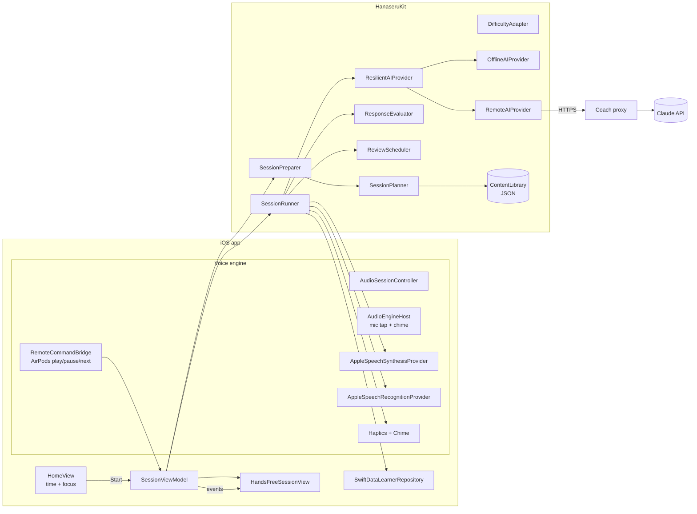

# Hanaseru（話せる）— Architecture & Plan

*A Japanese speaking coach in your pocket, built around high-speed-rail work.*

This document covers the twelve planning items the product spec asks for before implementation.
It is the source of truth for structure; update it when the structure changes.

---

## 1. Current project assessment

| Question | Finding |
|---|---|
| Existing code | None. The repository was empty (not even a git repo). |
| Xcode / deployment target | No Xcode project existed. Chosen target: **iOS 17.0** (SwiftData, `@Observable`, async `AVAudioApplication` permission APIs). |
| Existing app | No. Greenfield. |
| Dependencies | None. The iOS app deliberately uses **zero third-party dependencies** (Apple frameworks only). The backend proxy uses the official `@anthropic-ai/sdk`. |
| Development environment | The machine used to write Milestone 1 is **Windows 11** with Node 24, Python 3.14 and git — **no Xcode, no Swift toolchain**. This means the Swift code was written without a compiler in the loop; see Risks (§11). The backend proxy *was* type-checked and tested here. |

Consequences:

* The Xcode project is described declaratively with **XcodeGen** (`project.yml`) so it can be generated on a Mac instead of hand-writing a `.pbxproj` on Windows.
* All logic that doesn't need Apple frameworks (learning engine, conversation engine, session state machine) lives in a **Swift package** (`Packages/HanaseruKit`) that builds on macOS, Linux *and Windows* — so it can be unit-tested with `swift test` without a simulator.

## 2. Proposed architecture

Three strictly separated layers (spec §55), plus the app shell:

```
┌──────────────────────────────── iOS app (App/) ─────────────────────────────────┐
│  SwiftUI screens · design system · SwiftData persistence · settings/Keychain     │
│  LAYER 3 — Voice engine: AVAudioSession, AVAudioEngine, SFSpeechRecognizer,      │
│            AVSpeechSynthesizer, chime, haptics, remote commands (AirPods)        │
└──────────────┬───────────────────────────────────────────────────────────────────┘
               │ implements protocols from ↓
┌──────────────▼──────────── HanaseruKit (Swift package, platform-neutral) ────────┐
│  SessionCore      — hands-free session state machine (SessionRunner), voice      │
│                     protocols (SpeechSynthesisProvider / SpeechRecognitionProvider│
│                     / CueFeedbackProvider), LearnerRepository protocol           │
│  ConversationCore — LAYER 2: AIProvider protocol, OfflineAIProvider,             │
│                     RemoteAIProvider (→ proxy), ResilientAIProvider (fallback)   │
│  LearningCore     — LAYER 1: content model + bundled JSON content, fuzzy         │
│                     response evaluator, multi-dimensional knowledge model,       │
│                     spaced-repetition scheduler, difficulty adapter, planner     │
└──────────────────────────────────────────────────────────────────────────────────┘
               │ HTTPS (app token)
┌──────────────▼──────────── backend/ (Node, optional) ───────────────────────────┐
│  Coach proxy: holds the Anthropic API key, builds prompts, returns strict JSON.  │
└──────────────────────────────────────────────────────────────────────────────────┘
```

Rules:

* `LearningCore` knows nothing about AI, audio, or UI.
* `ConversationCore` knows about learning content but nothing about audio or UI.
* `SessionCore` orchestrates a session through **protocols only**; the concrete voice engine and persistence are injected by the app. This is what makes the hands-free flow unit-testable with scripted "speech".
* Japanese content is **data** (JSON in `LearningCore/Content`), never literals in SwiftUI views (spec §57). The only Japanese strings in Swift are in tests and previews.

## 3. MVP architecture diagram



## 4. Data model

Two kinds of model, deliberately separate:

**Value types in `LearningCore` (content + learning state, Codable, Sendable):**

| Type | Purpose |
|---|---|
| `LearningItem` | A phrase/sentence/question with kana, romaji, English, literal meaning, politeness, usage note, `promptEn` (for "say it naturally"), `acceptableResponses`, `keyTerms`, `commonMistakes`, optional `listening` check, `naturalAlternatives`, `track` (work/everyday), `level` 1–8. |
| `VocabularyTerm` | Professional/railway corpus entry: kanji, kana, romaji, English, categories, level, example. |
| `GrammarPattern` | Pattern id, form, meaning, when a professional would say it. |
| `Scenario` / `ScenarioBeat` | Role-play: persona, situation, beats (partner line + example learner responses + key terms), role-reversal flag, target terms, closing line. |
| `Persona` | Role-play character: name, role, personality, speaking rate, formality, style. |
| `CoachCue` | Spoken instruction (「聞いてください。」 etc.) in Japanese + English gloss. |
| `KnowledgeState` | Per item, **independent dimensions** (spec §32): recognition, listening, spokenRecall, pronunciation (intelligibility only), grammar, context — each a `DimensionState` (strength, stability, due date, reviews, lapses) — plus average response latency. |
| `DifficultyProfile` | Internal level 1–8 (spec §18 — never shown as a game level), English support, speech rate, response window. |
| `MistakeObservation` | Type, what was said, correction, explanation, item. |
| `ExerciseResult`, `SessionSummary` | Session outcomes and metrics. |

**SwiftData records in the app (persistence only):**

| Record | Stores |
|---|---|
| `LearnerProfileRecord` | Name, onboarding flag, encoded `DifficultyProfile`. |
| `KnowledgeRecord` | `itemID` + encoded `KnowledgeState`. |
| `MistakeRecord` | Aggregated error database (spec §30): type, correction, occurrences, first/last seen, last utterance text. |
| `SessionRecord` | Session metrics and encoded `ExerciseResult`s. |
| `PersonalPhraseRecord` | "My Japanese" phrases (heard / used / struggled / want to remember). |

All SwiftData properties have defaults and there are no `.unique` constraints, so the store can move to CloudKit sync later (spec §58) without a schema rewrite. **No raw audio is ever persisted** (spec §29/§60); the only speech-derived data stored is the *text* of utterances attached to mistakes, which "Delete voice data" wipes.

## 5. AI architecture

```swift
public protocol AIProvider {
    func generateResponse(_ request: TurnRequest) async throws -> TurnResponse      // conversation turn
    func evaluateResponse(_ request: EvaluationRequest) async throws -> TurnEvaluation
    func generateExercise(_ request: ExerciseRequest) async throws -> LearningItem
    func generateScenario(_ request: ScenarioRequest) async throws -> Scenario
    func explainGrammar(_ request: GrammarRequest) async throws -> GrammarExplanation
    func generateReview(_ request: ReviewRequest) async throws -> SessionReview
    func adaptDifficulty(_ request: DifficultyRequest) async throws -> DifficultyProfile
}
```

* **`OfflineAIProvider`** — always available. Drives scenarios from their scripted beats, evaluates with the local fuzzy evaluator, and is honest about what it can't judge (it never marks a free answer "incorrect" just because it doesn't match an example).
* **`RemoteAIProvider`** — calls the coach proxy (`/v1/turn`, `/v1/evaluate`). The proxy returns strict JSON (Claude structured outputs), so the app decodes typed values rather than parsing prose.
* **`ResilientAIProvider`** — tries remote with a hard timeout (hands-free latency budget), falls back to offline on any failure, and reports that it degraded so the UI can show "offline mode".
* A single conversation turn returns **evaluation + next line in one call** to keep hands-free latency to one round-trip.
* **No API key ships in the app** (spec §54). The app holds only a per-user token for *your* proxy, stored in the Keychain. The proxy holds the Anthropic key.
* Evaluation is two-stage: the local `ResponseEvaluator` runs first (instant, offline); only when it isn't confident does the runner ask the AI for a second opinion.
* Model: `claude-opus-5` at `effort: low` for conversational latency, with server-side refusal fallbacks enabled. Model and effort are proxy environment variables.

## 6. Speech / audio architecture

| Concern | Implementation |
|---|---|
| Audio session | `.playAndRecord`, options `.allowBluetooth` (AirPods mic), `.allowBluetoothA2DP`, `.defaultToSpeaker`, `.duckOthers`; `setAllowHapticsAndSystemSoundsDuringRecording(true)` so haptics still fire. Interruption and route-change observers pause the session (e.g. phone call, AirPods removed). |
| Background | `UIBackgroundModes = audio`. One `AVAudioEngine` runs for the **whole session** (input tap + chime player node) so the audio session stays active when the phone is locked or in a pocket. |
| TTS | `AVSpeechSynthesizer` with the best installed `ja-JP` voice (Premium/Enhanced if downloaded) and an English voice (default `en-IN`, fallback `en-US`). Async wrapper with cancellation. Speed multipliers 0.75× / 1.0× / 1.25× / 1.5× map onto AVSpeech rates. |
| Speech recognition | `SpeechRecognitionProvider` protocol. Default implementation: `SFSpeechRecognizer(ja-JP)`, **on-device when supported**, partial results, contextual strings from the expected vocabulary, silence-based end-pointing (no button press), start timeout, max duration, confidence when available. Replaceable (e.g. iOS 26 `SpeechAnalyzer`, or a cloud ASR) without touching the session logic. |
| Turn-taking cues | Spoken cue (「あなたの番です。」) + a two-tone chime on the engine + haptic. The chime is what makes "your turn" noticeable with the phone in a pocket. |
| Voice commands | During your turn you can say 「もう一度」 (repeat), 「わかりません」 (give me the answer), 「スキップ」/「次」 (skip), 「ちょっと待って」 (pause). |
| AirPods | `MPRemoteCommandCenter` play/pause/toggle → pause/resume; next track → skip exercise. Now Playing info shows the current step. |
| Honesty | Pronunciation is only assessed as **intelligibility** ("your speech was clearly understood" / "these words weren't recognized"). No pitch-accent claims until real acoustic analysis exists (Phase 3). |

## 7. Screen map

```
Onboarding (first run only)
 ├─ Welcome + name
 ├─ Microphone & speech permission (with privacy explanation)
 └─ "Put on your earphones" → Home

Tab bar
 ├─ Practice (Home)
 │   ├─ Greeting · "How much time do you have?" 2 / 5 / 10 / 20 / 30
 │   ├─ Focus: Surprise me · Work · Everyday · Conversation · Listening · Speaking · Shadowing
 │   ├─ START → Hands-free session (full screen)
 │   │            ├─ status: coach speaking (waveform) / your turn / listening (mic level) / thinking
 │   │            ├─ current line (kana/kanji per Kanji Intensity) + your transcript + feedback card
 │   │            ├─ pause · skip · end   (AirPods can do the same)
 │   │            └─ Session summary → one phrase to remember
 │   ├─ I HEARD THIS (quick capture sheet, < 10 s)
 │   └─ My Japanese preview (recent phrases, recurring mistakes)
 ├─ My Japanese — phrases (heard / used / struggled / want) · recurring mistakes
 ├─ Progress — minutes listened/spoken, conversations, expressions, learning map
 └─ Settings — name, kanji intensity, romaji, English voice, AI coach server, privacy & delete voice data
```

## 8. Professional Japanese content architecture

* `LearningCore/Content/*.json`, loaded by `ContentLibrary`:
  * `vocabulary.json` — railway, civil, project management, safety, quality, meetings corpus (spec §5). Terms can sit in several categories (確認 is in PM, safety and quality).
  * `phrases.json` — `LearningItem`s for listening / "say it naturally" / shadowing, work and everyday tracks, each with acceptable answers, key terms, common-mistake patterns, politeness and usage context.
  * `scenarios.json` + `personas.json` — the eight professional scenarios from the spec plus social ones, including a role-reversal first meeting.
  * `grammar.json` — patterns with "when would a Japanese professional actually say this?".
  * `cues.json` — spoken coach instructions.
* **Recurrence over lists** (spec §4): items carry `terms` (vocabulary ids); scenarios carry `targetTerms`. The planner and the AI both receive target terms, so 進捗 appears as a question, an answer, a meeting opener and a problem follow-up.
* **Politeness registers** are explicit on every item (`casual` / `professional` / `veryPolite`); politeness mismatches are classified *contextually inappropriate*, not *incorrect*.
* **Personal content wins**: phrases the learner adds become `LearningItem`s and get a priority boost in planning (spec §15).
* Adding content = editing JSON; no Swift changes. Later phases can download content packs (spec §65).

## 9. Development phases

| Milestone | Scope |
|---|---|
| **M1 (this commit)** | App shell, short onboarding, 2/5/10/20/30-minute selection, hands-free session runner (listening, "say it naturally", conversation, shadowing, closing phrase), Japanese TTS + ASR, AI conversation via proxy with offline fallback, spoken feedback, mistake tracking, knowledge model + spaced repetition, difficulty adaptation, basic Work/railway content, My Japanese (manual add), progress dashboard, privacy controls. |
| M2 | Spoken diagnostic (5–10 min → learning profile, no fabricated scores), "I heard this" AI lookup (transcription candidates, meaning, related expressions), "Use it again" engine (personal phrases seeded into scenarios), daily work recall prompt (notification). |
| M3 (spec phase 2) | Technical meeting & site inspection simulations with end-of-meeting evaluation, "I have a Japanese meeting" before/after mode, "Ask me something", professional question training, casual ⇄ professional register drills, dynamic AI-generated scenarios. |
| M4 (spec phase 3) | Media mode, railway media, advanced shadowing, pitch-accent analysis, widgets, Siri Shortcuts / App Intents ("Start 5 minutes of Japanese"), Watch, iCloud sync, content packs. |

Each milestone: plan → implement → compile → test → verify UX on device → commit.

## 10. External services

| Service | Needed for | Required? |
|---|---|---|
| Apple Speech (on-device or Apple servers) | Japanese ASR | Yes (built-in). On-device if the Japanese model is installed; otherwise audio goes to Apple. |
| Apple TTS voices | Japanese/English speech | Built-in. Download *Japanese — Premium/Enhanced* voice for quality. |
| Anthropic Claude API | Dynamic conversation, fuzzy evaluation | Optional. Without it the app runs fully offline with scripted scenarios. |
| A host for the proxy | Keeps the API key off the phone | Optional. Any Node 22+ host (Fly.io, Render, a small VPS, or your laptop on the same Wi-Fi for testing). |
| Apple Developer account | Installing on your iPhone | Free account works for personal device installs (7-day re-sign); paid for TestFlight. |

## 11. Risks and limitations

* **Uncompiled Swift.** M1's Swift was written on Windows without a compiler. Expect a handful of compile errors on first build in Xcode; they should be local fixes. The package's logic is covered by tests that will run with `swift test` once a toolchain is available.
* **Background microphone.** iOS allows continued recording in the background only while the audio session stays active; that's why one engine runs for the whole session. Starting a *new* session from the lock screen isn't possible. Verify on device: lock the phone mid-session and confirm it keeps going.
* **AirPods microphone** forces the Bluetooth HFP profile while recording, so the coach's voice sounds lower quality through AirPods than music does. It's an iOS constraint with no workaround while the mic is open.
* **Speech recognition** is optimised for native speech; learner speech may be transcribed as a different but plausible sentence. The evaluator is deliberately lenient, and the AI prompt tells Claude to assume ASR errors. Server-based recognition has per-request duration limits; each turn is a separate short request.
* **Pronunciation** can't be measured from a transcript. The app only reports intelligibility.
* **Remote commands** (AirPods press) only reach the app while it's the "Now Playing" app; best-effort.
* **Latency.** One AI round-trip per conversation turn; typical 1.5–4 s. The runner says a short filler (e.g. 「そうですね…」) only if the wait exceeds a threshold — planned tweak after on-device measurement.
* **CarPlay** is out of scope (voice-based apps need a specific CarPlay entitlement category).

## 12. First implementation milestone (M1)

**Goal:** a polished 5–10 minute hands-free Japanese session that passes the spec's hands-free UX test (§62):

1. Open app → tap **10 min** → **Start**.
2. Put phone in pocket, AirPods in.
3. Hear 「今日は仕事の日本語を練習しましょう。」 then 「聞いてください。」 → a realistic sentence.
4. Hear a question, a chime, 「あなたの番です。」 → answer by voice; silence ends your turn automatically.
5. Hear feedback — communication first (「意味はよく伝わります。もっと自然に言うと……」).
6. A role-play (e.g. progress meeting with 鈴木さん) with follow-up questions.
7. Shadowing at slow then natural speed.
8. 「今日の練習は終了です。」 + one phrase to remember, repeat it, 「お疲れさまでした。」
9. Never needing to look at the screen. Pause/resume/skip possible from AirPods or by voice.

**Acceptance checks:** `swift test` passes in `Packages/HanaseruKit`; `npm test` passes in `backend/`; app builds; the hands-free test above passes on a physical iPhone with the screen locked.
